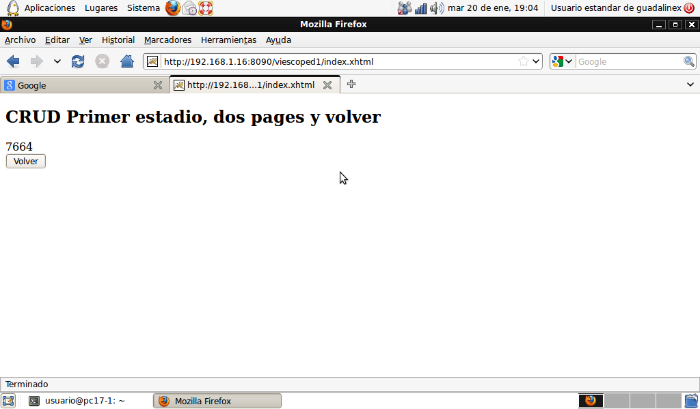
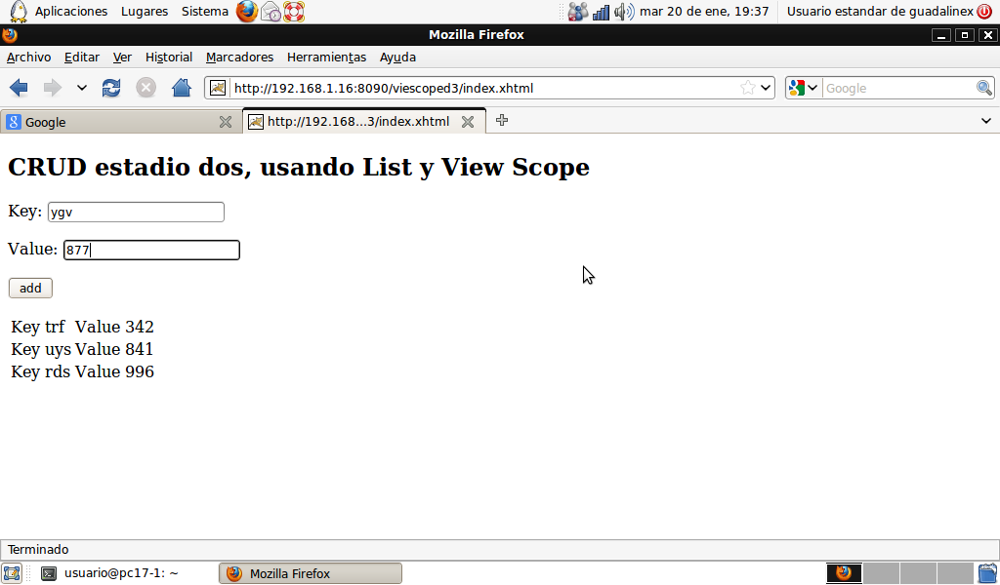

# JSF Clase 3

Analizamos el proceso de construcción una aplicación JSF. Para esta tarea nos
promonemos una serie de momentos, hasta llegar a una base más o menos decente
y sencilla de acciones CRUD. No vamos a preocuparnos de establecer persistencia
pero sí situamos el DAO en la estructura del código.

## CRUD: estadio inicial

#### Una vista y RequestScoped 
{:lang="xhtml"}
    <!DOCTYPE html PUBLIC "-//W3C//DTD XHTML 1.0 Transitional//EN"
      "http://www.w3.org/TR/xhtml1/DTD/xhtml1-transitional.dtd">
    <html xmlns="http://www.w3.org/1999/xhtml"
          xmlns:h="http://java.sun.com/jsf/html"
    <h:head>
    </h:head>
    <h:body>
      <h2>CRUD Primer estadio</h2>
      <h3>Add Data</h3>
      <h:form>
        
Key:
         <h:inputText value="#{obj.key}"/>
        

        
Value:
         <h:inputText value="#{obj.value}" />
        

        

         <h:commandButton value="add" action="#{obj.add}" />
        

      </h:form>
      <h:outputText value="#{obj.value}" />
    </h:body>
    </html>

Como observamos nuestra única página _index.html_ permite introducir dos 
entradas de texto una clave y un valor. Cuando el usuario reciba y vea esta
vista, en la aplicación (server side) ya existirá una instancia
de una clase en el backend llamada _obj_, es nuestro bean administrado, de este
objeto se ocupa el controlador JSF. Vemos la única clase, y así nos damos una
idea de las acciones que admite nuestro _obj_.     
{:lang="xhtml"}
    package com.sample.bean;
    import java.io.Serializable;
    import java.util.ArrayList;
    import java.util.List;

    import javax.faces.bean.ManagedBean;
    import javax.faces.bean.RequestScoped;

    import com.sample.model.Property;

    @ManagedBean(name="obj")
    @RequestScoped
    public class ViewManager   implements Serializable{
      private Property item = new Property();
      private String key;
      private String value;
      public String getKey() {
        return key;
      }
      public void setKey(String key) {
        this.key = key;
      }
      public String getValue() {
        return value;
      }
      public void setValue(String value) {
        this.value = value;
      }
      public void add() {
        System.out.println("=" + this.key + "=" + this.value + "=");
        setValue(this.value + "==");
      } 
    }

Vemos que se define un miembro tipo _item_ tipo Property, que no usaremos
en este estadio de la aplicación, la idea es crear en una de las
siguientes etapas una _lista_ de objetos _items_, mientras tanto nos hacemos
la idea que formando parte de la lógica de la aplicación tenemos un _model_
constituído por la clase Porperty y una parte _bean_ en la cual está definido
nuestra clase ViewManager. Lo que en nuestro proyecto es una carpeta
com/sample/bean y otra com/sample/model      

Para acceder a la aplicación lo hacemos mediante una url http://misitio.com:8080/app/index.xhtml obtendríamos

{:center=""}

El usuario podrá rellenar y enviar los datos, JSF entonces ejecuta el
_método add_, ya que el componente _commandButton_ en su atributo _action_
tiene como valor #{obj.add}. En las dos líneas de código de dicho método
se accede a dos miembros del objeto _obj_, nuestro bean administrado.   
¿Cuál es el valor de los miembros _key_ y _value_, en ese momento?
El controlador JSF en una fase anterior ha debido ejecutar
los _métodos setters_ de key y value; es decir ha realizado el trabajo de
llevar los datos del _view tree_ (los componentes del formulario en memoria),
a la instancia _obj_, el managed bean. JSF ha debido usar el método _setValue_
para dar al _manged bean_ el dato introducido por el usuario en el campo
respectivo y que ha pasado a ser el contenido de uno de los componentes
inputText en el árbol. Por otra parte tengamos en cuenta que las vistas se
_envían_ al usuario _renderizando_ a partir del árbol de componentes.
Esta es la razón por la cual obtiene el usuario como respuesta a su envío de
datos, una vista como la siguiente:

{:center=""}

¿Por qué el inputText de _value_ contiene ahora el valor actualizado?
El miembro _value_ ha sido modificado por el _método add_, acción seleccionada
por el usuario, estaríamos en la *fase 5 del ciclo de vida* _invoke application_
.     
¿Qué ocurre luego de la ejecución del _método add_?
Es determinante el retorno del método invocado por la acción del usuario, si
el retorno es void o nulo se renderiza la vista actual, este es nuestro caso.
Estamos en la *fase 6* _render response_ los valores a ser mostrados son 
recuperados desde el _back bean_ mediante los métodos _getters_, y así se
muestran en el formulario.

Es de destacar que el *real proceso del formulario* tras el envío del mismo,
ocurre en la fase 5, que en nuestro caso está representada por las dos líneas
de código del _método add_.

En el *próximo estadio* nos proponemos que la aplicación envíe una segunda 
página luego del proceso del formulario. ¿Cómo procedemos?, esta otra
página, que llamaremos _salida.xhtml_ es la que contiene un outputText con
el contenido actual del _atributo value_.    
Para solucionar esto debemos atender al retorno del método de la acción; si 
modificamos el _método add_ haciendo que retorne un tipo String,
siendo éste _salida_ o _salida.xhml_ el problema estaría resuelto,
debido que el framework cargará en memoria a _salida.xml_ y obtendrá
los datos del managed bean usando los métodos _getters_, con lo que el componente
outputText, en la última fase _render response_ contiene el valor actualizado
del _atributo value_

## CRUD: primer estadio

#### Dos vistas y RequestScoped

Con lo explicado, veamos el contenido de _salida.xhtml_
{:lang="xhtml"}
    <!DOCTYPE html PUBLIC "-//W3C//DTD XHTML 1.0 Transitional//EN"
    "http://www.w3.org/TR/xhtml1/DTD/xhtml1-transitional.dtd">
    <html xmlns="http://www.w3.org/1999/xhtml"
        xmlns:h="http://java.sun.com/jsf/html"
    <h:head>
    </h:head>
    <h:body>
       <h2>CRUD Primer estadio, dos pages</h2>
       <h:outputText value="#{obj.value}" />
    </h:body>
    </html>

{:center=""}

La figura 3.3 muestra el valor actual del _atributo value_ introducido por el
usuario, hemos dejado el código del _método add_ como sigue,
{:lang="java"}
    public String add() {
       // hace algo...procesa el formulario.
       return "salida";
    }
como se aprecia retorna un string, el cual será tenido en cuenta por el framework para renderizar.    

Ahora, procedemos a añadir un _botón volver_, con el objeto de retornar _index.xhtml_
{:lang="xhtml"}
    <!DOCTYPE html PUBLIC "-//W3C//DTD XHTML 1.0 Transitional//EN"
    "http://www.w3.org/TR/xhtml1/DTD/xhtml1-transitional.dtd">
    <html xmlns="http://www.w3.org/1999/xhtml"
        xmlns:h="http://java.sun.com/jsf/html"
    <h:head>
    </h:head>
    <h:body>
       <h2>CRUD Primer estadio, dos pages y volver</h2>
       <h:outputText value="#{obj.value}" />
       <h:form>
         <h:commandButton value="Volver" action="index" />
       </h:form>
    </h:body>
    </html>

En el atributo _action_ del botón no se invoca método, entonces aquel
texto _index_ juega el mismo papel que el string retornado por el método de
la acción, con lo que no debemos modificar en nada el código de la clase
ViewManager, para conseguir esta funcionalidad.

{:center=""}

Al accionar el botón veremos nuevamente _index_xhtml_ el framework ha debido
cargar y crear el árbol de componentes contenidos en la página, estamos en
una nueva request, se produce una nueva instanciación del managed bean, y el anterior bean al ser RequestScoped ya no existe.

Podrías comprobar, que si el bean administrado es SessionScoped, en lugar
de ver en el formulario los inputText en blanco, estos conservarían su último
valor.

Respecto a lo anterior _nos queda como tarea pendiente_ averiguar como podemos
dar valores iniciales al managed bean.   
Veamos la lógica de esta cuestión, si es el framework quien crea el objeto,
no debemos

{:center=""}

La única vista:

<!DOCTYPE html PUBLIC "-//W3C//DTD XHTML 1.0 Transitional//EN"
"http://www.w3.org/TR/xhtml1/DTD/xhtml1-transitional.dtd">
<html xmlns="http://www.w3.org/1999/xhtml"
	xmlns:ui="http://java.sun.com/jsf/facelets"
	xmlns:h="http://java.sun.com/jsf/html"
	xmlns:f="http://java.sun.com/jsf/core"
	xmlns:c="http://java.sun.com/jsp/jstl/core">
<h:head>
</h:head>
<h:body>

	<h2>CRUD estadio dos, usando List y View Scope</h2>
		<h:form>
			
Key:
				<h:inputText value="#{viewManager.item.key}" />
			

			
Value:
				<h:inputText value="#{viewManager.item.value}" />
			

			

				<h:commandButton value="add" action="#{viewManager.add}" />
			

		</h:form>
		<h:dataTable value="#{viewManager.cacheList}" var="item">
			<h:column>
				Key <h:outputText value="#{item.key}" />
			</h:column>
			<h:column>
				Value <h:outputText value="#{item.value}" />
                        </h:column>
		</h:dataTable>
</h:body>
</html>

Y la clase

package com.sample.bean;

import java.io.Serializable;
import java.util.ArrayList;
import java.util.List;

import javax.faces.bean.ManagedBean;
import javax.faces.bean.ViewScoped;

import com.sample.model.Property;

@ManagedBean
@ViewScoped
public class ViewManager   implements Serializable{

	ArrayList<Property>   cacheList = new ArrayList ();
	private Property item = new Property();
	private String key;
	private String value;

	public String getKey() {
		return key;
	}

	public void setKey(String key) {
		this.key = key;
	}

	public String getValue() {
		return value;
	}

	public void setValue(String value) {
		this.value = value;
	}
	public void add() {
		cacheList.add(item);
		item = new Property();
        }

        public List getCacheList() {
		return cacheList;
        }
        public Property getItem() {
           return item;
        }
}

La clase Property

package com.sample.model;

public class Property {

	private String key;

	private String value;

	public String getKey() {
		return key;
	}

	public void setKey(String key) {
		this.key = key;
	}

	public String getValue() {
		return value;
	}

	public void setValue(String value) {
		this.value = value;
	}
}
