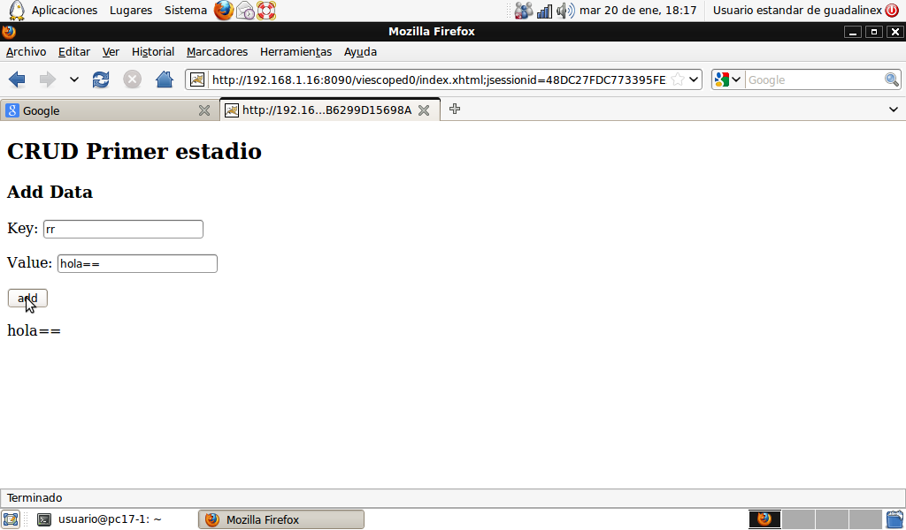

# JSF Clase 3

Analizamos el proceso de construcción una aplicación JSF. Para esta tarea nos
promonemos una serie de momentos, hasta llegar a una base más o menos decente
y sencilla de acciones CRUD. No vamos a preocuparnos de establecer persistencia
pero sí situamos el DAO en la estructura del código.

## CRUD: estadio inicial
#### Una vista y RequestScoped 
{:lang="xhtml"}
    <!DOCTYPE html PUBLIC "-//W3C//DTD XHTML 1.0 Transitional//EN"
      "http://www.w3.org/TR/xhtml1/DTD/xhtml1-transitional.dtd">
    <html xmlns="http://www.w3.org/1999/xhtml"
          xmlns:h="http://java.sun.com/jsf/html"
    <h:head>
    </h:head>
    <h:body>
      <h2>CRUD Primer estadio</h2>
      <h3>Add Data</h3>
      <h:form>
        
Key:
         <h:inputText value="#{obj.key}"/>
        

        
Value:
         <h:inputText value="#{obj.value}" />
        

        

         <h:commandButton value="add" action="#{obj.add}" />
        

      </h:form>
      <h:outputText value="#{obj.value}" />
    </h:body>
    </html>

Como observamos nuestra única página _index.html_ permite introducir dos 
entradas de texto una clave y un valor. Cuando el usuario reciba y vea esta
vista, en la aplicación (server side) ya existirá una instancia
de una clase en el backend llamada _obj_, es nuestro bean administrado, de este
objeto se ocupa el controlador JSF. Vemos la única clase, y así nos damos una
idea de las acciones que admite nuestro _obj_.     
{:lang="xhtml"}
    package com.sample.bean;
    import java.io.Serializable;
    import java.util.ArrayList;
    import java.util.List;

    import javax.faces.bean.ManagedBean;
    import javax.faces.bean.RequestScoped;

    import com.sample.model.Property;

    @ManagedBean(name="obj")
    @RequestScoped
    public class ViewManager   implements Serializable{
      private Property item = new Property();
      private String key;
      private String value;
      public String getKey() {
        return key;
      }
      public void setKey(String key) {
        this.key = key;
      }
      public String getValue() {
        return value;
      }
      public void setValue(String value) {
        this.value = value;
      }

      public void add() {
        System.out.println("=" + this.key + "=" + this.value + "=");
        setValue(this.value + "==");
      } 
    }

Accediendo mediante una url http://misitio.com:8080/app/index.xhtml    

{:center=""}

el usuario podrá rellenar y enviar los datos, JSF entonces ejecuta el
_método add_, ya que el componente _commandButton_ en su atributo _action_
tiene como valor #{obj.add}. En las dos líneas de código de dicho método
se accede a dos miembros del objeto _obj_, nuestro bean administrado.   
¿Cuál es el valor de los miembros _key_ y _value_, en ese momento?
El controlador JSF en una fase anterior ha debido ejecutar
los _métodos setters_ de key y value; es decir ha realizado el trabajo de
llevar los datos del _view tree_ (los componentes del formulario en memoria),
a la instancia _obj_, el managed bean. JSF ha debido usar el método _setValue_
para dar al _manged bean_ el dato introducido por el usuario en el campo
respectivo y que ha pasado a ser el contenido de uno de los componentes
inputText en el árbol. Por otra parte tengamos en cuenta que las vistas se
_envían_ al usuario _renderizando_ a partir del árbol de componentes.
árbol de componentes. Esta es la razón por la cual obtine, una
vez haya enviado datos, la siguiente vista:

{:center=""}

¿Por qué el inputText de _value_ contiene ahora el valor actualizado?

